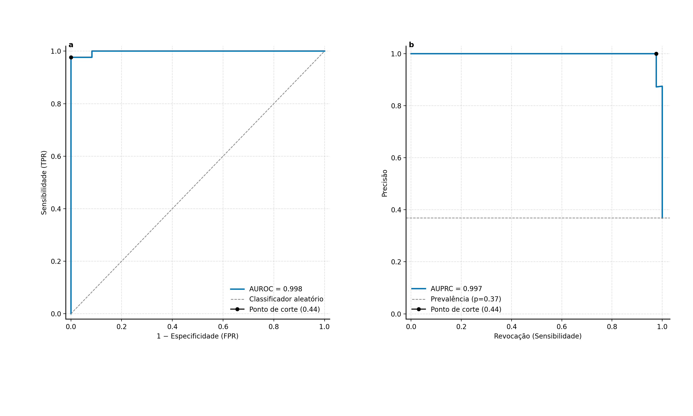

# Diagnótico do câncer de mama utilizando CNN-1D

Este projeto utiliza um algoritmo de rede neural convolucional 1D (CNN) para classificar tumores de mama como malignos ou benignos, usando o conjunto de dados Breast Cancer Wisconsin (Diagnostic).

## Crie um ambiente virtual

Criar ambientes virtuais é útil pra evitar problemas de versão entre bibliotecas usadas pra diferentes projetos além de não instalar um monte de coisa desnecessária deixando seu PC lento.
### Windows

* `python -m venv nome_do_ambiente`
* `nome_do_ambiente\Scripts\activate`

### Mac e Linux

* `python -m venv nome_do_ambiente`
* `source meu_ambiente_virtual/bin/activate`

Pronto, ambiente virtual criado 

### Base de dados

A [base dados](https://www.kaggle.com/datasets/wasiqaliyasir/breast-cancer-dataset/data) que eu estou usando foi baixada da plataforma Kaggle.

# Explicando o projeto

* A seguir trago uma explicacao mais detalhada do algoritmo.

## Requisitos

- Python 3.8+
- TensorFlow
- NumPy
- Pandas
- Matplotlib
- Seaborn
- scikit-learn

Instale as dependências com:
```bash
pip install tensorflow numpy pandas matplotlib seaborn scikit-learn
```

## Passo a Passo

### 1. Carregamento e Pré-processamento dos Dados

- O arquivo `Breast_cancer_dataset.csv` é carregado.
- Colunas irrelevantes (`id`, `Unnamed: 32`) são removidas.
- A coluna `diagnosis` é convertida para valores binários: `M` (maligno) = 1, `B` (benigno) = 0.
- Os dados são divididos em features (`X`) e rótulos (`y`).

### 2. Divisão dos Dados

- Os dados são divididos em treino, validação e teste 
  * 60% teste
  * 20% validação
  * 20% teste
- As features são normalizadas com MinMaxScaler.
- As matrizes de features são convertidas para o formato 3D (amostras, features, canais=1) esperado pela camada Conv1D.

### 3. Construção do Modelo

- O modelo é uma rede sequencial com as seguintes camadas:
  - Conv1D (32 filtros, kernel 5, ReLU)
  - MaxPooling1D
  - Dropout
  - Conv1D (64 filtros, kernel 5, ReLU)
  - GlobalMaxPooling1D
  - Dense (64 unidades, ReLU)
  - Dropout
  - Dense (1 unidade, Sigmoid)
- Métricas monitoradas: AUC ROC, AUC PR, Acurácia binária.

### 4. Treinamento

- O modelo é treinado por até 200 épocas, com early stopping e redução de taxa de aprendizado.
- O melhor modelo (maior AUC de validação) é salvo em `checkpoints/best_val_auc.keras`.

### 5. Avaliação

- Probabilidades de predição são geradas para validação e teste.
- O melhor limiar de decisão é escolhido para maximizar o F1 na validação.
- Métricas detalhadas são calculadas: ROC AUC, PR AUC, precisão, revocação, F1, matriz de confusão, etc.
- Relatórios de classificação são impressos para ambos limiares (0.5 e F1-max).

### 6. Visualização

- Curvas ROC e PR são geradas e salvas em `wdbc_roc_pr_test.pdf`.
- Gráficos de acurácia/perda do treinamento são salvos em `acuracia_perda.pdf`.
- Matriz de confusão do teste é salva em `matriz_confusao.pdf`.
- Mapa de calor de correlação entre features é salvo em `mapa_calor.pdf`.

## Execução

Execute o script principal:
```bash
python main.py
```

Os arquivos de saída (PDFs) serão gerados na pasta do projeto.

## Estrutura dos Arquivos

- `main.py`: Script principal.
- `Breast_cancer_dataset.csv`: Base de dados.
- `checkpoints/`: Modelos salvos.
- Arquivos PDF/PNG: Resultados das análises e gráficos (nesse caso voce precisa converter o PDF para imagem, opcionamente você tem a visualização já disponível com `plot.show()`).

# Gráficos com os melhores resultados obtidos

### Curva de desempenho



### Matriz de confusão


### Matriz de correlação entre features


